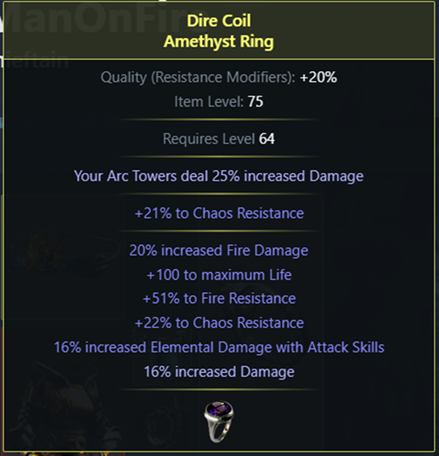
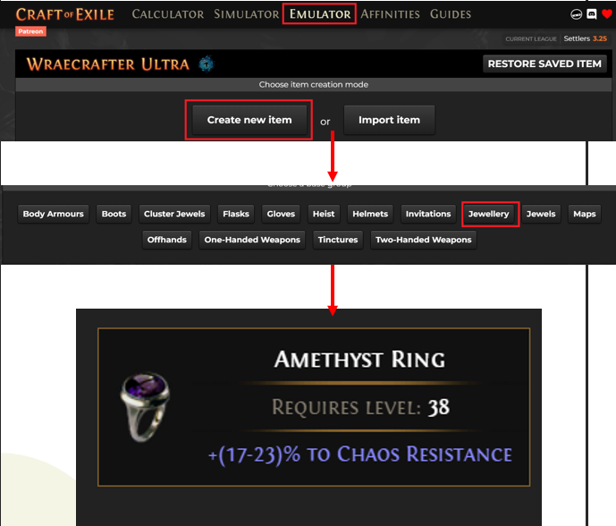
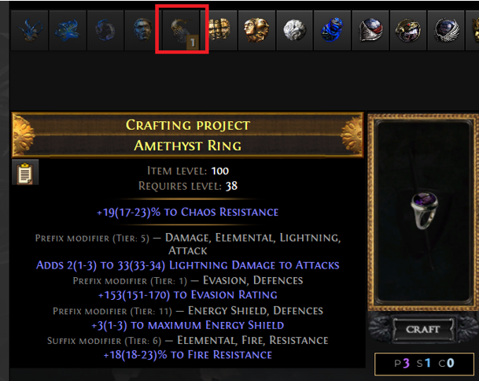
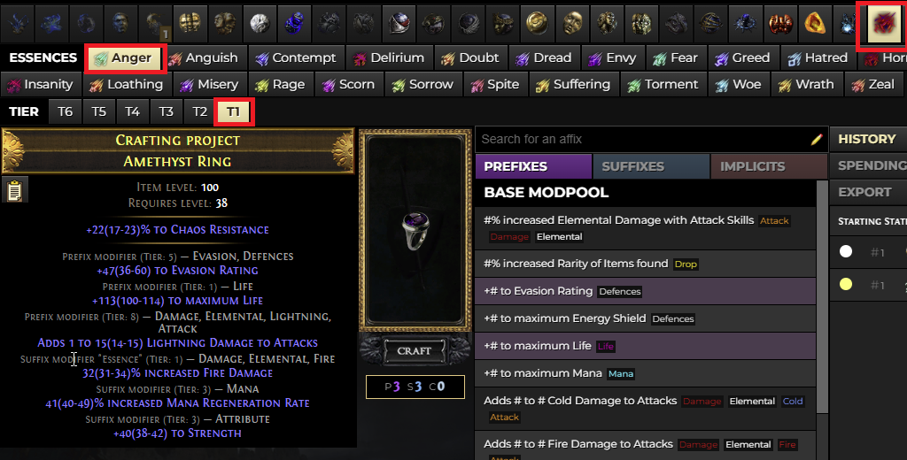
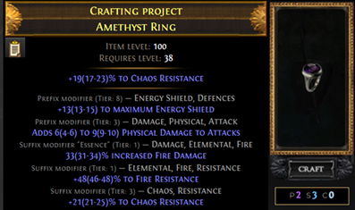
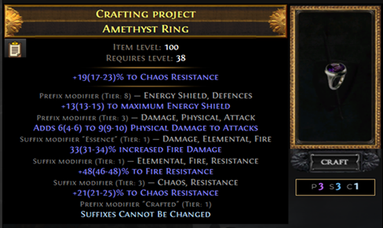
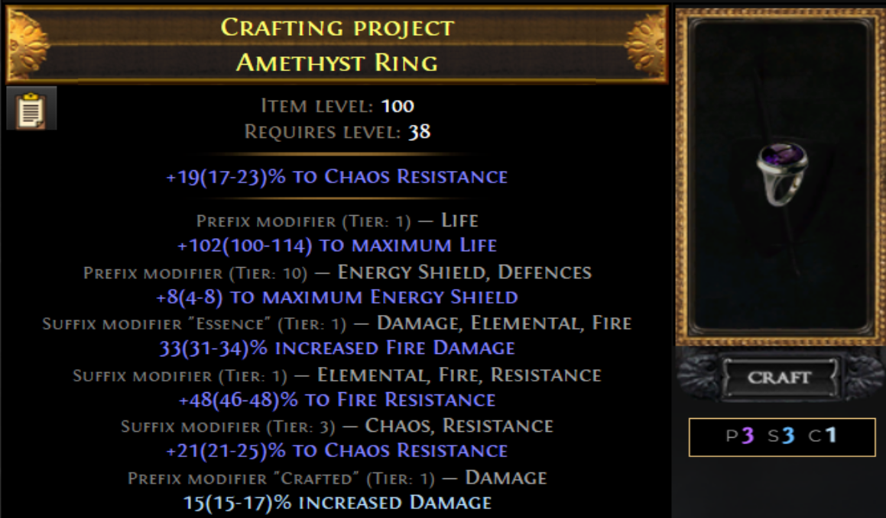

Proviamo a utilizzare quello che abbiamo visto finora per craftare insieme un anello tipicamente usato nelle build Righteous Fire. 
Si tratta di un craft semplice, che utilizza le tecniche base del crafting.

# **Il risultato che vogliamo ottenere**

Si parte dal fondo: analisi del risultato che vogliamo e simulazione su CoE. 

Da come abbiamo visto in precedenza, sappiamo che chaos res è l’unica mod con tag chaos

Ora dobbiamo scegliere quale strada scegliere:
Base fractured se economica
Base non fractured se costosa

Se facciamo un'analisi su Craft of Exile vediamo che l’unico modo per ottenere fire damage è tramite eseence

---

# **Il piano**

1. **Craftiamo i suffissi** : Tramite Essence Spam, perchè è l’unico modo di avere Fire Damage
2. **Metamod Reforge** : Blocchiamo i Suffissi e Riforgiamo Chaos, Chaos Res sarà garantita
4. **Culo, Yolo e currency** :Se non becchiamo il tier di chaos res, ci arrabattiamo per sistemare l’oggetto
5. **Finire l’oggetto** : Ragioniamo su come finire gli ultimi affissi
7. **Settle / Ripartire** : Come vedrete, è solo una questione di currency disponibile

---

# **Craftiamolo su CoE**

Andiamo su Emulator e creiamo la base

- Craft New Item
- Jewellery 
- Amethyst Ring

Quale iLv scegliere??

Facile: basta andare nella sezione **Calculator**, scegliere un Amethyst ring e guardare qual è l’iLv minimo per il tier degli affissi che vogliamo. 

---

# **Essence Spam**

Primo step: spammare essenze

- Usiamo un alchemy per farlo diventare raro   
- Facciamo essence spam fino a una qualsiasi res T2-T1 e un open suffix

{: .nota }
Se esce Fire Resistance ma ti serviva Cold, nessun problema: Harvest offre un craft che permette di convertire un suffisso di tipo resistenza in un altro elemento. Potrai quindi cambiarla in seguito.

---

# **Metamod + Harvest**

- Applichiamo “Suffixes cannot be changed” dal Crafting Bench  
- Usiamo Reforge Chaos da Harvest: garantisce Chaos Resistance  
- Se il tier di Chaos Res non è soddisfacente, possiamo usare un Orb of Annulment per tentare di salvarlo oppure ripartire con Essence spam

---

# **Finire l’oggetto: riflessione**

Ora abbiamo due strade:  
### Strada 1: 
- Puliamo i prefissi e blocchiamo Mana  
- Facciamo doppio Exalt Slam: se non otteniamo almeno T2 Life,  
- Usiamo Remove Crafted Mod + Suffixes Cannot Be Changed (sempre con Wild Bristle Matron se vogliamo risparmiare qualche Divine) + Scouring, e ripartiamo da capo

### Strada 2:  
- Possiamo usare Suffixes Cannot Be Changed + Reforge Life  

Proviamo a seguire questa seconda strada. 
{: .nota } 
Se i suffissi sono già pieni, Suffixes Cannot Be Changed può anche essere forzato tramite Wild Bristle Matron (Beastcraft)

---

# **Finiamo l'oggetto**

- Usiamo Suffixes Cannot Be Changed + Reforge Life finché non otteniamo almeno T2 Life  
- Una volta raggiunto il tier desiderato, facciamo Bench Craft (se c’è un prefix libero)

### **Considerazioni**

L’oggetto è finito?

E’ bello, peccato per quel tier 3….

Cosa facciamo?

Sta a voi, in base a quanto è importante quell’affisso e quanto potete/volete investire, a quanto si vende se lo volete vendere

{: .nota } 
Non esiste mai una strada univoca per il crafting in PoE. Si tratta semplicemente di sfruttare gli strumenti a disposizione per cercare di influenzare l'rng a nostro favore. Ma per quanto possiamo influenzarlo, l'rng rimane. Quali tecniche e quali tentativi usare rimane esclusivamente una questione di budget.