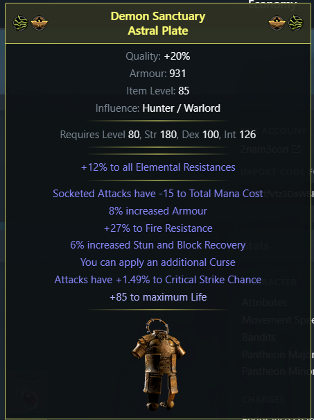
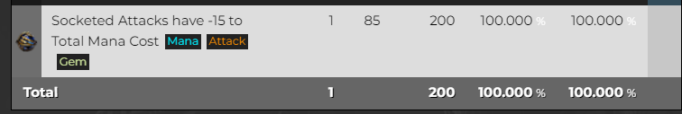
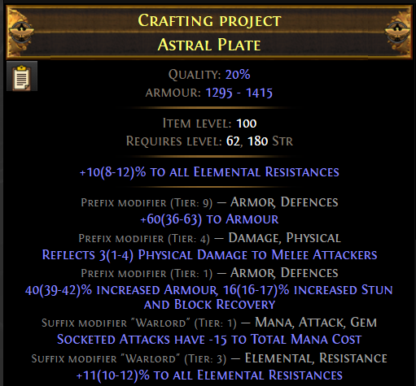
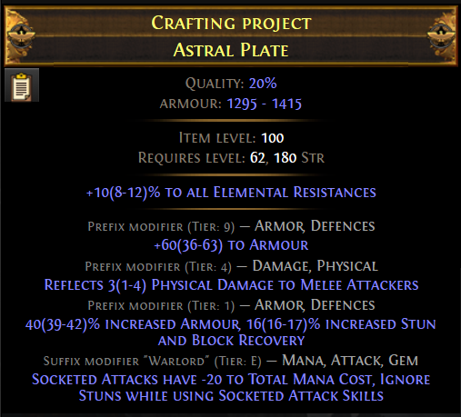
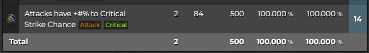
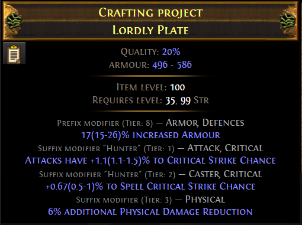
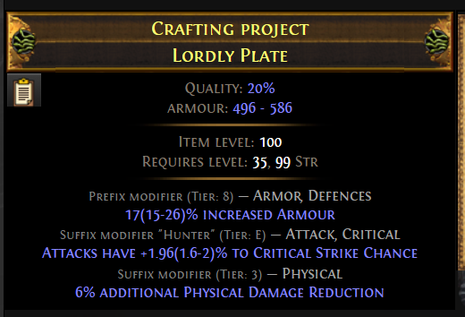

# Crafting Chest Doppio Elevated

## Obiettivo

Ottenere su Astral Plate:

- Elevated Socketed Attacks
- Elevated Attack
- Additional Curse
- Life

Il resto degli affissi sarà casuale (dipende dall'Awakened Orb).

---

## Piano di crafting

1. **Prima base Warlord**

   - Rollare `Socketed Attacks -15 mana`
   - Elevarlo con **Orb of Dominance**.

2. **Seconda base Hunter**

   - Rollare `Attack Crit`
   - Elevarlo con **Orb of Dominance**.

3. **Fondere con Awakener Orb**

    - Prendere le due basi con il mod elevated.
    - Fonderle con **Awakener Orb** 

4. **Prefix**
    - Ragioniamo su come mettere additional curse

5. **Settle/Veiled**
    - Bench craft life / veiled orb + bench craft

---

## 1. Primo Elevated

- Su craft of exile notiamo che `Reforge Attack`su una base del warlord è 100% di hittare socketed -15. 

- Spammiamo `Reforge Attack` fin ad hittare `Socketed Attacks have -15 mana` + un altro mod influenzato.

- Usare **Orb of Dominance** per elevare uno dei due.
- Se viene elevato il mod inutile ma valido → vendere.
- Altrimenti → tenere e proseguire.

## 2. Secondo Elevated

(immagini wip)

- Su [Craft of Exile](https://www.craftofexile.com/) notiamo che `Reforge Attack`su una base hunter ha un 50% di hittare `Attacks have +% to critical chance`

- Spammiamo `Reforge Attack` fin ad hittare i due mod analogamente a prima

- Usare **Orb of Dominance** per elevare uno dei due.
- Se viene elevato il mod inutile ma valido → vendere.
- Altrimenti → tenere e proseguire.

## 3. Awakener Orb

- Cliccare su **Awakener Orb**
- Cliccare sulla corazza da distruggere
- Cliccare sull’astral plate
Se abbiamo un open suffix possiamo usare `Suffixes cannot be changed` + `Reforge Fire/Lightning` per forzare una resistenza.

{: .nota } 
**Attenzione** : l'item può anche fillarsi utilizzando il reforge!

In questo caso abbiamo ottenuto life recovery rate, non possiamo mettere una res e quindi proseguiamo con il craft 

## 4. Prefix

-  Ragionando con [Craft of Exile](https://www.craftofexile.com/) ci accorgiamo che l’unico prefix di tag caster è Additional Curse
- Facciamo `Suffixes cannot be changed` (possiamo anche usare una [Wild Bristle Matron](https://www.poewiki.net/wiki/Wild_Bristle_Matron) se vogliamo risparmiare) e facciamo `Reforge caster`
- Ora possiamo craftare life e quindi accontentarci, oppure proseguire

## 5. Rifinitura finale con Veiled Currency

WIP

