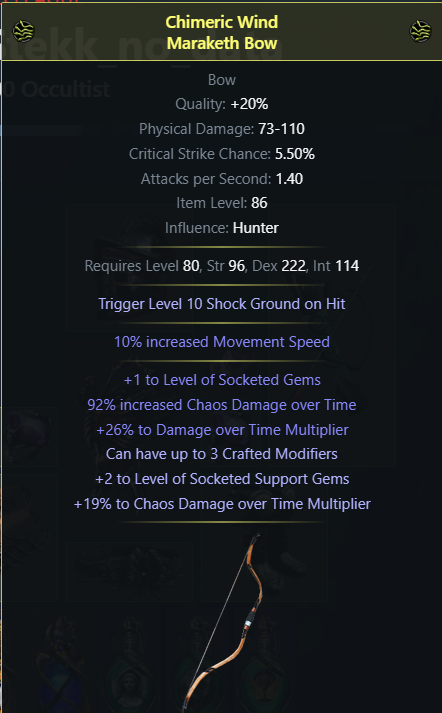
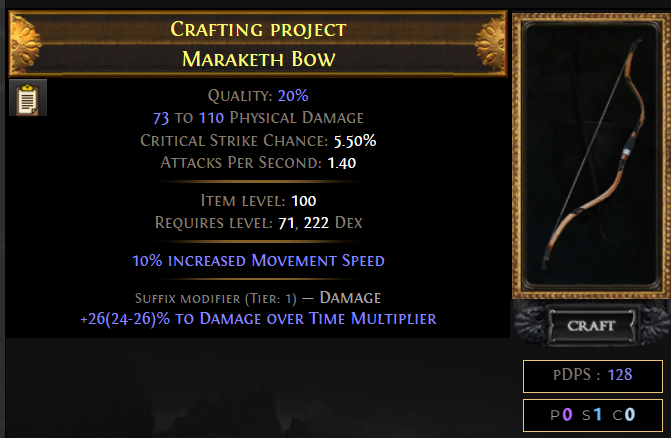
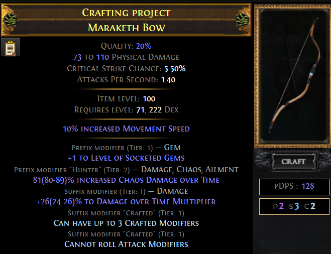
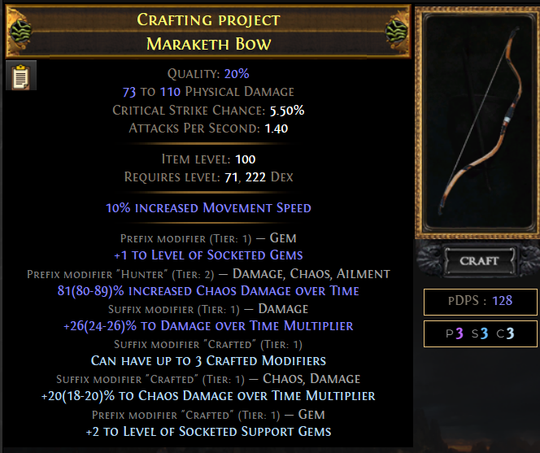

# Arco per Toxic Rain 
L'esempio è utile come esempio di applicazione dei Metamod "Cannt Roll Attack". 
L'arco che andremo a Creare è come quello riportato nell'immagine

 
## Piano di crafting

1. **Alteration Spam**

   - Otteniamo T1 DoT Multi

2. **Regal Orb + Annul**

   - Vogliamo ottenere un item raro con solo T1 DoT Multi

3. **Prefissi**

    - Multimod + ex-slam + hunter

4. **Suffissi**
    - Multimod

# **Alteration spam**  
   Si spammano alteration fino a trovare **T1** `Damage over Time Multiplier`.  
   Una volta ottenuto, si usa **Regal Orb** per rendere l’oggetto raro.  
   A questo punto, lo si pulisce con **Orb of Annulment** fino a che non abbiamo solo il T1 DoT multi su un oggetto raro.

# **Multimod, Cannot Roll Attack e conseguente blocco dei suffissi**  
   - Bench craft: *Can have up to 3 crafted modifiers*  
   - Bench craft: *Cannot roll attack modifiers*
   A questo punto i suffissi sono pieni, e notiamo da [Craft of Exile]("https://www.craftofexile.com/?game=poe1&b=20&ob=both&v=d&a=x&l=a&lg=19&bp=y&as=1&hb=0&bld={}&im={}&ggt=|&ccp={}&gvc={%22limit%22:88}&af={%223%22:%221%22}") tutti i prefissi **eccetto uno** che è quello che ci interessa, hanno il tag attack. I due step successivi diventano quindi deterministici.    
   - Usiamo un **Exalted Orb** per forzare `+1 to level of socketed gems`.  
   - Usiamo **Hunter Exalted Orb** per ottenere `Chaos Damage over Time`.

# **Chiusura**  
   - Rimuoviamo i mod craftati temporanei.  
   - Ri-Craftiamo *Can have up to 3 crafted modifiers*.  
   - Aggiungere con bench craft:  
     - `+2 to level of socketed support gems`  
     - `% Chaos damage over time multiplier`  

---
