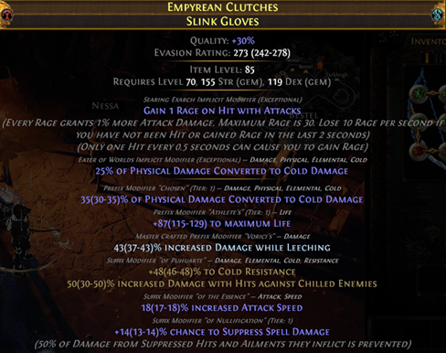
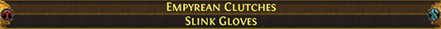
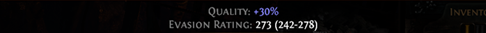
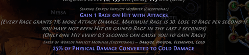
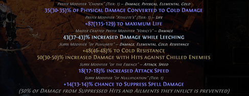

# **Analisi di un Item**

Analizziamo le informazioni presenti in un item, partendo da questo esempio.

---

### Nome item:
Casuale, dipende dai bonus dell’item. In questo caso "Empyrean Clutches". Puoi trovarli su PoE DB.

### Item Base: 
In questo caso "Slink Gloves". La base determina le statistiche difensive/offensive dell'oggetto. Consulta Craft of Exile (CoE) per individuare la base migliore.

---

### Qualità

La qualità migliora l'attributo base dell'oggetto (in questo caso l'evasion rating).
Maggiore è la qualità, più è facile ottenere un 6-link usando le fusing.

- Migliorabile con Armourer’s Scrap (fino al 20%) 
- Per ottenere il 30% è necessario che la base droppi già al 30

### Defensive Base 

In questo caso l'"Evasion Rating" è l'attributo difensivo (o offensivo) base dell'oggetto.
- Può essere rollato con la Sacred Orb
- Se usi FilterBlade e un item ha una scia viola, è perché ha un roll al 100%

---

### Item Level (ilvl)

Determina il tier massimo degli affissi applicabili (vedi [CoE](https://www.craftofexile.com/)).

### Requirement 

Attributi richiesti per equipaggiare l’oggetto.
- Più alta è la richiesta di dex, più probabile sarà avere socket verdi (str → rossi, int → blu)
- Influenza anche gli affissi possibili (vedi [CoE](https://www.craftofexile.com/)) 
    - Dex: evasion e suppress
    - Int + Str: energy shield + armour
    - Ecc.

---

### Impliciti

Ogni oggetto può avere dei bonus Impliciti, che non fanno parte dei normali affissi e non vengono alterati dalle comuni currency di crafting. Normalmente, un oggetto può avere al massimo 2 impliciti, ed esistono metodi diversi per ottenerli. L'esempio più comune di mod *Implicito* è quello che troviamo sugli anelli: L'anello **Ruby Ring** ha come implicito *+% Fire Resistance*, che non può essere modificato con la normale currency.

 <b>Informazioni Aggiuntive sugli impliciti</b> 
    

Se non conosci il significato di alcuni termini della descrizione qui sotto, non ti preoccupare e passa oltre. Per ora tutto quello che ti serve sapere è racchiuso nelle due frasi sopra 

<ul>
<li>Il modo più comune per controllare gli impliciti sulle armature, è quello di utilizzare le Eldritch Currency (vedi crafting avanzato) per ottenere degli impliciti di tipo <b>Searing Exarch</b> o <b>Eater of Worlds</b>, come nell'immagine</li>
<li>Un altro modo per ottenere un implicito su un oggetto è <b>Corromperlo</b> utilizzando un <b>Vaal Orb</b> : uno degli esisti della corruzione è l'aggiunta di un Implicito all'item</li>
<li>Analogamente al vaal orb, l'utilizzo del <b>Locus of corruption</b> può avere come effetto la corruzione potente che può risultare nell'aggiunta di due impliciti, detta comunemente "<b>doppia corruzione</b>". Ci si riferisce a questi oggetti come "<b>doppio corrotti</b>"</li>
<li>L'ultimo modo per avere degli impliciti è quella di avere un oggetto <b>Sintetizzato</b>. Gli oggetti sintetizzati hanno la particolarità di avere un Implicito che si discosta dal normale pool di impliciti che sarebbe possibile trovare su quell'oggetto usando uno degli altri metodi. Per esempio, è possibile trovare Anelli sintetizzati che hanno come implicito "+1 Max Endurance Charges" invece del classico "+#% Elemental Resistance".</li>
</ul>
Sebbene tutte le basi possono potenzialmente avere degli impliciti, esistono alcuni modificatori del tipo di base che sono mutualmente esclusivi. Le regole di mutua esclusione sono:

<ul>
<li>Un oggetto <b>non influenzato</b> può avere impliciti del Searing/Eater o impliciti sintetizzati</li>
<li>Un oggetto <b>fractured</b> non può avere impliciti <b>sintetizzati</b></li>
<li>Un oggetto <b>fractured</b> non può essere <b>influenzato</b></li>
<li>Il tier degli impliciti Searing/Eater può essere upgradato con <b>Orb of Conflict</b></li>
<li>L’implicito può essere sostituito con una <b>Vaal Orb</b> o con il <b>Locus of Corruption</b></li>
</ul>

---

### Affissi

- Suddivisi in prefissi e suffissi
- Un oggetto **magico** può avere al massimo 1 prefisso e 1 suffisso
- Un oggetto **raro** può avere fino a 3 prefissi e 3 suffissi
- Hanno un Tier che determina i valori [min, max] rollabili
- Hanno un valore rollato all’interno del Tier

{: .nota } 
Il **roll** può essere modificato con Divine Orb. Per modificare il **tier**, è necessario riforgiare o rerollare l’oggetto
