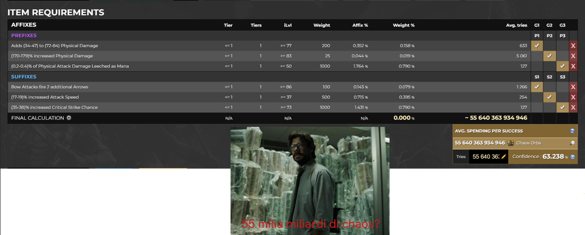

# Tecniche di Crafting di base

In questa sezione andiamo ad analizzare le tecniche di Crafting di base e alcune loro possibili combinazioni

1. TOC
{:toc}

---

# **Metamod**

I Metamod Mod che influenzano gli effetti dei craft
- **Suffixes/prefixes cannot be changed**: utile per pulire un item o mantenerne inalterata una parte mentre si rolla l'altra
- **Can have up to 3 crafted modifier**: utile per riempire affissi di un oggetto con benchcraft
- **Cannot roll attack/caster modifier**: utili forzare affissi attraverso exalted slam o per pulire un item 
Se utilizziamo scouring / annullment mentre l’ogggetto ha un metamod come suffixes/prefixes cannot be changed, quegli affisi non verrano modificati

---

# **Tag**

Gli affissi hanno (quasi) sempre dei tag. Funzionano come “Categorie”. Vengono usati dal gioco per regolare alcune proprietà, per esempio quali modificatori possono rollare o meno su un oggetto.

Ogni affisso può avere ha uno o più tag: `caster`, `attack`, ecc.
Alcuni affissi NON hanno tag. Per esempio *Spell Suppression* non ha tag, il che lo rende difficile da targettare 

## Uso dei Tag su Craft of Exile

Se andiamo su [Craft of Exile](https://www.craftofexile.com/) e selezioniamo un item a caso, il sito ci mostrerà i **tag** disponibili per quell’item (visibili nella parte alta dell’interfaccia).

Se clicchiamo su uno di questi tag, vedremo la lista degli **affissi** corrispondenti.

**Esempio pratico**:
- Selezioniamo un *Anello*
- Clicchiamo sul tag `caster`
- Il sito mostrerà che l’unico affisso con tag `caster` applicabile all’anello è **Cast Speed**

Questo ci permette:
- Usare **Harvest Reforge Caster** in modo mirato (Cast Speed garantito)
- Bloccare altri affissi con metamod o bench-craft per forzare i risultati

Questo ci verrà molto utile dopo

---

# **Tag Blocking e Slam Controllato**

Possiamo usare la conoscenza dei **tag** per influenzare l’esito dei craft.

### Caso pratico: blocco di un affisso sgradito

1. Abbiamo **3 suffissi** già presenti su un oggetto.
2. Crafteremo un affisso con **alto weight** ma **inutile** (es. `+mana`).
3. Applichiamo **doppio Exalted Slam**.

Poiché `+mana` è già presente, e il suo **tag** è bloccato tramite **benchcraft**, non potrà più uscire.

4. Rimuoviamo il bonus mana.
5. Craftiamo l'affisso desiderato.

Se non otteniamo l’affisso voluto:

- Si esegue di nuovo: `Suffixes cannot be changed` + `Scouring`.
- Ripetere il ciclo finché non si ottiene il risultato.

{: .nota } 
Questo approccio sfrutta la logica interna dei **tag** e dei **weight** per eliminare risultati indesiderati e migliorare la probabilità di colpire affissi utili.

# **Harvest Crafting mirato con i Tag**

Una volta capita la logica dei **tag**, possiamo sfruttarla per usare al meglio la bench di **Horticrafting**.

### Funzionamento

- Serve **Lifeforce** del colore corretto (verde, blu, rosso).
- La mod “**Reforge with a guaranteed mod of tag X**” forza almeno un affisso con quel **tag**.

### Esempio pratico

- Oggetto: *Anello*
- Azione: **Reforge Caster**
- Risultato: Esce sempre **Cast Speed**  
  (è l’unico affisso `caster` disponibile sugli anelli)

Stesso principio vale per:
- `Reforge Chaos` sugli anelli → garantisce `Chaos Resistance`
- `Reforge Fire` su gloves → garantisce `Fire Damage to Attacks`, ecc.

{: .nota } 
Combinare il reforge di Harvest con il tag blocking è una tecnica solida per ottenere affissi desiderati in modo deterministico.

---

# **Combinare Harvest e Metamod**

Una tecnica avanzata consiste nel **bloccare** gli affissi già buoni usando metamod, e poi usare **Harvest Reforge** per craftare gli altri.

### Procedura

1. Abbiamo **3 suffissi** buoni.
2. Li abbiamo “**puliti**” (cioè rimosso i prefissi).
3. Applichiamo:  
   `Suffixes cannot be changed`
4. Usiamo **Reforge [Tag]** via Harvest (es. `Reforge Life`, `Reforge Fire`, `Reforge Chaos`).
5. Se otteniamo il prefisso giusto, con roll buono → proseguiamo.
6. Altrimenti, ripetiamo:
   `Suffixes cannot be changed` + `Reforge`

### Completamento

Una volta ottenuti gli affissi desiderati:

- Si chiude l’item con `benchcraft`, `Exalted Slam`, o `Tag Blocking + Veiled Orb`, .

{: .nota } 
Metodo efficace per conservare affissi rari o costosi e lavorare solo sulle parti mancanti.

---

# **Eldritch Currency**

Le **Eldritch Currency** sono fondamentali per il crafting su oggetti **non influenzati** o **sintetizzati**.

### Vantaggi principali

- Permettono `Reforge Keep Prefixes` o `Reforge Keep Suffixes`.
- Se l’item è **riempito** (full), possiamo usare:
  - `Eldritch Chaos Orb` → rerolla una mod
  - `Eldritch Annullment` → rimuove una mod
- In questo modo, possiamo "salvare" un craft parzialmente riuscito.

### Meccanica di Dominanza

- Ogni oggetto ha **Eater of Worlds** o **Searing Exarch** come influenza.
- Solo una può essere attiva: prevale quella con il **tier più alto**.
- Le currency indicano chiaramente quale parte (prefix/suffix) modificano.

{: .nota } 
Non è necessario che l’oggetto abbia **entrambe** le influenze. Ne basta una, purché sia quella che ci interessa. Se le ha entrambe, occorre farne diventare una dominante (basta usare una currency di tier basso e una di tier alto sull'oggetto)

---

# **Metodi comuni di Crafting**

Alcuni degli approcci ricorrenti nella pratica:

### Strategia 1: Harvest/Essence + Eldritch

- Comprare una **base fractured** (es. con suffisso buono).
- Spammare **Harvest Reforge** o **Essence** fino a ottenere 3 suffissi utili.
- Rifinire l’item con:
  - **Eldritch Currency**
  - **Bench Craft**
  - **Veiled Orb** per ottenere mod rare

### Strategia 2: Fossil + Eldritch

- **Base fractured (suffix)**
- Spammare **Fossil** per cercare prefissi desiderati
- Usare `Prefixes cannot be changed`
- Veiled Orb o Reforge finale
- Completare con **bench**

La scelta migliore dipende dal costo attuale delle currency sul mercato e dal valore dell’item target.

{: .nota } 
Non si può craftare un mirror item con due chaos. Serve usare tante currency e mod costosi.

Quanto costa craftare un mirror tier itemm??
