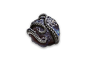

# Tecniche di Crafting – Livello Avanzato

1. TOC
{:toc}

---

# Veiled Chaos Orb

wip

# Veiled Exalted Orb

wip

# Orb of Dominance 

- Utilizzabile solo su item con **2 mod influenzate**.
- **Effetto**: rimuove una delle due mod e eleva il tier dell’altra (può passare a `Elevated`).
- Non può essere utilizzata su: Jewel, Armi primarie/secondarie.
- Conviene usarla solo quando l’item ha esattamente 2 mod influenzate.

## Awakener Orb 

- **Funzione**: Unisce le influenze di due oggetti dello stesso tipo.
- **Metodo**:
  1. Distrugge il primo oggetto, applicando la sua influenza al secondo.
  2. Il secondo diventa raro con entrambe le influenze e nuovi affissi.

