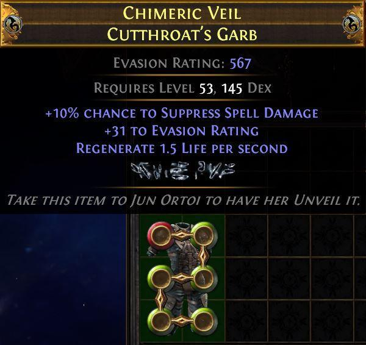
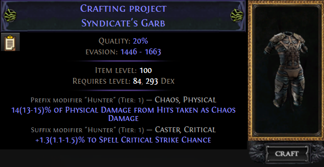
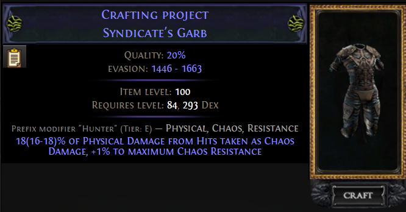
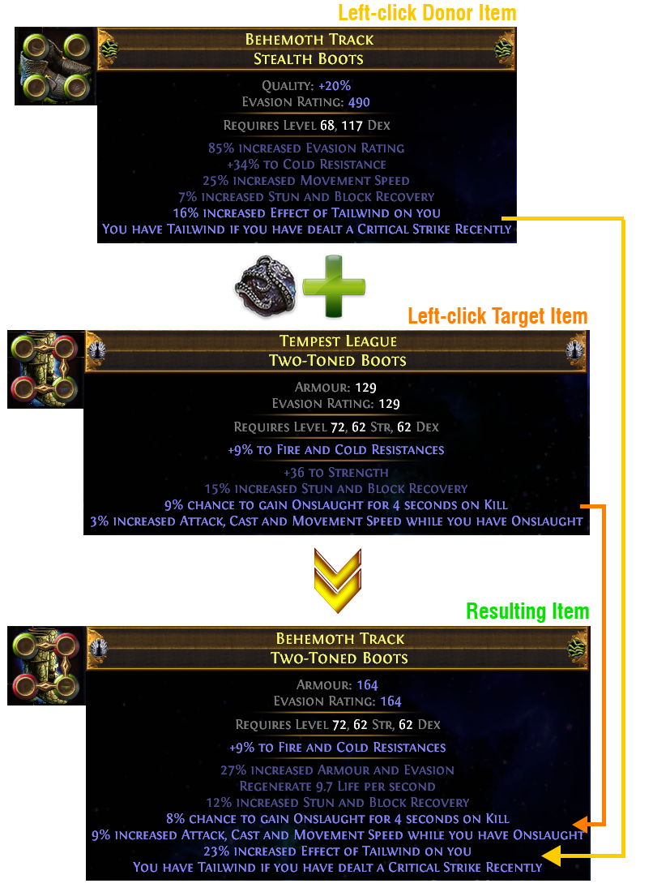

# Tecniche di Crafting – Livello Avanzato

1. TOC
{:toc}

---

# **Veiled Chaos Orb** 

La **Veiled Chaos Orb** è una currency rientrata con la 3.26 – riforgia un oggetto raro con nuovi affissi e **garantisce un** [**veiled mod**](https://www.poewiki.net/wiki/List_of_veiled_modifiers)

## Dettagli e funzionamento

- **Riforgia** un oggetto raro con mod casuali **e garantisce un mod veiled**
- **NON** include i [signature veiled modifiers](https://www.poewiki.net/wiki/Immortal_Syndicate) nella pool
- Primo introdotto in patch 3.14.0 e poi reintrodotto in 3.26.0 :contentReference

## Utilizzo pratico

- Serve per aggiungere un *veiled modifier* garantito, utile quando si punta a topping affissi “Jun” o simili.
- Spesso usata su oggetti già con **3 affissi**: si blocca uno slot (es. suffisso), poi si veiled-chaosa per ottenere l’affisso veiled, quindi si ripulisce/rifinisce :contentReference

## Rischi e contro

- Esiste una probabilità che il veiled riempia uno slot bloccato :contentReference

## Quando usarlo

1. Hai **3 affissi desiderati**.
2. Blocchi uno slot con `Suffixes/Prefixes cannot be changed`.
3. Usi la **Veiled Chaos Orb** → ottieni un mod veiled.
4. Pulisci o rifinisci con Eldritch/bench/exalted/veiled, ecc.

## Integrazione con altre tecniche

- Si combina bene con:
  - **Tag blocking**: blocco tag inutili prima della veiled chaos.
  - **Eldritch Annullment/Chaos** per riforgiare affissi indesiderati.
  - **Metamod** per fissare affissi rari prima del veiled.

---

# **Veiled Exalted Orb** 

La **Veiled Exalted Orb** è una valuta che rimuove un modificatore da un oggetto raro e lo sostituisce con un mod **veiled** garantito.

## Quando usarla

- Si aggiunge un mod veiled, senza modificare il numero totale degli affissi, quindi **senza rischiare di riempire un oggetto** se già con 5 mod
- Ottima quando hai:
  1. 3 affissi desiderati di un tipo (prefix o suffix)
  2. Bloccato l'altro tipo con metamod o altro
  3. Vuoi aggiungere un mod veiled con **66 % di probabilità**, senza sovraccaricare — come suggerito su Reddit:  

## Strategia d’uso

1. Ottieni item con **5 affissi buoni** (3 prefix + 2 suffix o viceversa)
2. Blocca un tipo con `Prefixes/Suffixes cannot be changed`
3. Applica la **Veiled Exalted Orb**

---

# **Orb of Dominance** 

- Utilizzabile solo su item con **2 mod influenzate**.
- **Effetto**: rimuove una delle due mod e eleva il tier dell’altra (può passare a `Elevated`).
- Non può essere utilizzata su: Jewel, Armi primarie/secondarie.
- Conviene usarla solo quando l’item ha esattamente 2 mod influenzate.

---

# **Awakener Orb** 

- **Funzione**: Unisce le influenze di due oggetti dello stesso tipo.
- **Metodo**:
  1. Distrugge il primo oggetto, applicando la sua influenza al secondo.
  2. Il secondo diventa raro con entrambe le influenze e nuovi affissi.

