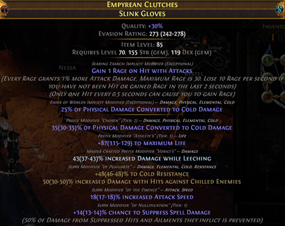
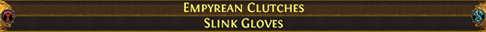
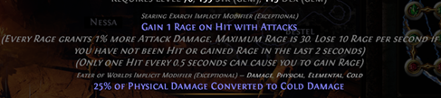
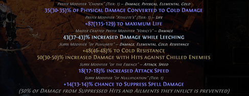

# Analisi di un Item

Analizziamo insieme le informazioni che possiamo trovare all'interno di un item, prendendo questo esempio.

---

### Nome item:
Casuale, dipende dai bonus dell’item. In questo caso "Empyrean Clutches" Li trovi su PoE DB

### Item Base: 
In questo caso "Slink Gloves", la base determina le statistiche difensive/offensive di base, vedere Craft of Exile (CoE) per trovare la base migliore

---

### Qualità

La qualità migliora l'attributo di base dell'oggetto (in questo caso l'evasion rating)
Più la qualità è alta e più è facile che si 6-linki con le fusing

- Migliorabile con armourer’s scrap (fino a 20%) 
- Per avere 30% l’unico modo è droppare la base al 30"

### Defensive Base 

In questo caso "Evasion Rating" è l'attributo difensivo (o offensinvo) di base dell'oggetto.
- Rollabile con sacred orb
- Se usate filter-blade e droppate un item con una scia viola è perché è rollata al 100% 

---

### Item Level (ilvl)

Influenza il tier massimo degli affissi che può avere (vedi su [CoE](https://www.craftofexile.com/)) 

### Requirement 

Attributi richiesti per essere equipaggiato
- Se richiede più dex è più facile che rolli socket verdi, str->ross, intt->blu
- Influenza gli affissi rollabili (vedi su [CoE](https://www.craftofexile.com/)) 
    - Dex: evasion e suppress
    - Int + Str: Energy Shield + Armour
    - Ecc…

---

### Impliciti

- Un oggetto **non influenzato** può avere impliciti del searing ed eater o impliciti sintetizzati
- Un oggetto **fractured** non può avere impliciti **sintetizzati**
- Un oggetto **fractured** non può essere **influenzato**
- Upgradabili tramite orb of conflict
- L’implicito può essere sostituito da una vaal orb 

---

### Affissi

- Divisi in suffissi e prefissi
- Un oggetto **magico** può avere fino a 1 prefisso e 1 suffisso
- Un oggetto **raro** può avere fino a 3 prefissi e 3 suffissi
- Hanno un Tier che determina i valori [min max] che possono rollare
- Hanno un valore rollato  all’interno del tier.

Nota: il **roll** può essere modificato con oggetti come le Divine Orb. Per modificare il **tier**, è necessario riforgiare/rerollare l’oggetto
